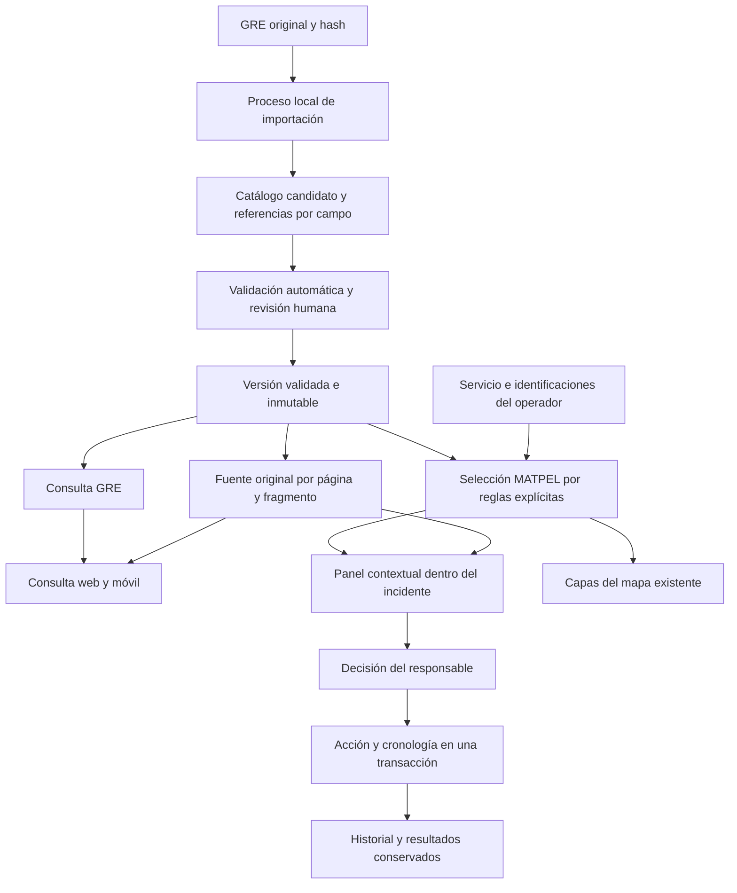

# Fase 2 — arquitectura de GRE / MATPEL

Fecha: 2026-10-08. Estado: diseño para implementación por fases. Las rutas, entidades y archivos nuevos de este documento **son contratos propuestos**, todavía sin implementar. La fase 1 y sus evidencias permanecen históricas.

Fuentes: [diagnóstico](FASE_1_DIAGNOSTICO.md), [reglas GRE](FASE_1_REGLAS_GRE.md), [requisitos originales](REQUISITOS_ORIGINALES.md), [contratos](FASE_2_CONTRATOS.md) y [experiencia de usuario](FASE_2_EXPERIENCIA.md).

## 1. Decisión de arquitectura

Extender el monolito NestJS y la aplicación Next/Flutter existentes. `GreModule` se ocupa del documento, catálogo, importaciones y fuentes. `MatpelModule` consume el catálogo, selecciona información contextual y registra cambios en el mismo Servicio y la cronología del núcleo de incidentes. Esta separación corresponde a dos responsabilidades reales: un catálogo documental puede consultarse sin incidente; las decisiones operativas requieren autorización y contexto del Servicio.

SQL Server y TypeORM siguen siendo la persistencia. No incorporar un segundo servidor, una base vectorial ni un sistema SCI paralelo. La extracción nativa se ejecuta en un proceso Python local, fuera de consultas HTTP. La herramienta diagnóstica actual se conserva; el importador productivo de fase 3 será otro comando, con dependencias/versiones declaradas y contrato de salida validado por NestJS.

Dependencias en una dirección: `MatpelModule → GreModule` y `MatpelModule → IncidenteNucleoModule`. `GreModule` no depende de incidentes, mapas, meteorología u OCR de campo. Los adaptadores de mapa, viento y reconocimiento no deben bloquear la consulta.

## 2. Patrones verificados y reutilización

| Fuente existente | Patrón que se conserva | Extensión concreta |
|---|---|---|
| [ServiciosService](../../backend/src/modules/servicios/servicios.service.ts:153) | Transacción, bloqueo, DTO y versión; datos de comunicación separados del Servicio | Mantener contrato de comunicación y añadir contexto MATPEL relacionado; versión obligatoria en mutaciones nuevas |
| [CronologiaService](../../backend/src/modules/incidente-nucleo/cronologia.service.ts:76) | Mismo EntityManager; clave idempotente comprobada antes de efectos; actor y fechas de hecho/registro | Nuevos tipos de evento MATPEL en entidad y migración aditiva, usando esta cronología |
| [AuditoriaService](../../backend/src/modules/seguridad/auditoria.service.ts:38) | Registro con EntityManager opcional | Para MATPEL exigir manager de la transacción de la acción, sin segunda auditoría fuera de ella |
| [PermissionsGuard](../../backend/src/modules/seguridad/guards/permissions.guard.ts:28) | Alternativas OR en varios permisos | Un permiso base por decorador; comprobar condiciones AND y alcance en el servicio de autorización |
| [ServicioActivoService](../../backend/src/modules/despacho/servicio-activo.service.ts) | Participación, Pantallas y confidencialidad | Adaptador al núcleo para acceso al Servicio; no duplicar selección de participantes ni atribuir mando por nombre de rol |
| [api.ts](../../frontend/src/lib/api.ts) | Prefijo, sesión, CSRF y manejo de error | Biblioteca `matpel.ts` con rutas relativas, misma sesión y DTOs explícitos |
| [VisorDocumento](../../frontend/src/components/VisorDocumento.tsx) | Blob PDF, liberación de URL, cierre y estados de carga/error | Extraer renderizador visual compartido, conservar props/API Documentos; envoltorio GRE añade página, fragmento y restitución de foco |
| [almacenamiento.ts](../../backend/src/shared/utils/almacenamiento.ts:121) | Referencia privada opaca y validación de acceso a archivo | Copia GRE inmutable en almacenamiento restringido propio. No depender del permiso para leer expedientes Documentos ni exponer `docs/Manuales` como carpeta pública |
| [MapaSeguimiento](../../frontend/src/components/MapaSeguimiento.tsx) / mapa del servicio | Leaflet y capas de recursos con acceso existente | Componente de capas GRE sobre mapa actual; autorizar posiciones de personal por separado |
| [offline.dart](../../.movile/lib/offline.dart) | Cache, cola, archivos, reintentos y limpieza de sesión | Paquete de catálogo verificable; conflictos MATPEL visibles y estado local/servidor diferenciado |
| [globals.css](../../frontend/src/app/globals.css) / [ConfirmProvider](../../frontend/src/app/components/ConfirmProvider.tsx) | Tokens azules, componentes propios, foco y confirmación | Reutilizar clases y tokens. Una confirmación concreta para identificación ambigua/decisión; consulta sin diálogos repetidos |

El permiso `servicios:operar` y `servicios:comandar` figura preparado en la migración 093; no se comprobó su aplicación en DB durante estas fases. `IncidenteNucleoModule` sigue siendo una dependencia de integración, no una API operativa acreditada.

## 3. Modelo conceptual y reglas de persistencia

Nombres SQL en snake_case; propiedades TypeScript en camelCase. UUID para entidades, datetimeoffset(3) para tiempos y convención institucional de creación de ids. Bigint de evento se transporta como string. Entidad y migración se incorporan juntas; `synchronize: false`.

### 3.1. Catálogo documental, esquema propuesto `matpel`

| Entidad conceptual | Contenido mínimo | Invariantes |
|---|---|---|
| `GreDocumento` / `gre_documentos` | Id, SHA-256, referencia privada, bytes, páginas, título, edición/idioma identificados, fecha de incorporación | Hash único; archivo íntegro conservado; edición no inferida del nombre |
| `GreVersion` / `gre_versiones` | Documento, versión parser/normalizador/esquema, hash de contenido estructurado, estado de validación, reporte y revisores | Resultado independiente del archivo. Misma identidad documento+parser+normalizador+esquema no duplica catálogo; versión validada no se sobrescribe |
| `GreImportacion` / `gre_importaciones` | Ejecución, versión candidata, progreso por etapa/página, errores, fecha/actor, intentos y heartbeat | Trabajo duradero y recuperable; un worker local autorizado reclama una tarea con lease, sin ejecutar shell aportado por HTTP |
| `GreActivacion` / `gre_activaciones` | Idioma, puntero a versión, revisión y último evento de activación | Una activa por idioma; cambio atómico. Historial auditado y activación previa recuperable |
| `GreReferencia` / `gre_referencias` | Versión, página PDF desde 1, etiqueta impresa, sección, tabla/fila/columna, caja y orientación, texto original, método y revisión | Referencia por campo/bloque/celda. Caja en puntos del PDF con transformación registrada; confianza solo si realmente disponible |
| `GreSeccion` / `gre_secciones` | Título original, orden, rango documental y tratamiento de texto/tabla/figura/notas | Toda página tiene tratamiento registrado; rangos y cantidad se descubren por edición, sin fijar 42 para futuras fuentes |
| `GreEntrada` / `gre_entradas` | Nombre original/normalizado, identificador de cuatro dígitos cuando exista, tipo de identificador si fuente lo explicita, guía, P, verde y fuentes de ambos índices | **Id de entrada distinto de identificador ONU.** Varios nombres/entradas por identificador; sin deduplicación semántica por intuición |
| `GreAlias` / `gre_aliases` | Alias explícito, entrada y fuente | Un nombre alternativo no se inventa por compartir ONU; se registra solo relación respaldada |
| `GreGuia` / `gre_guias` | Número, título, estado con contenido/intencionalmente vacía, bloques ordenados | Unicidad versión+número; 121/167 vacías se conservan |
| `GreBloque` / `gre_bloques` | Jerarquía, encabezado original, orden, texto íntegro y referencias; vínculos internos | Peligro primario y condiciones conservados. Apartados del resto de la GRE y glosario también representados |
| `GreTabla`, `GreFila`, `GreCelda` | Tipo de tabla, encabezados, condiciones, valores originales/estructurados, unidades, notas, referencias y posición | Tablas 1/2/3, BLEVE, agentes químicos, AEI y cualitativas incluidas. Cada celda es dato, referencia, vacío explícito o dato no validado; nunca cero implícito |
| `GreRegla` / `gre_reglas` | Código estable, condiciones/parámetros extraídos, tipo de uso, referencias y versión de interpretación revisada | Distinguir selección, advertencia y decisión humana. R01–R38 son referencias del análisis; no todas son fórmulas ejecutables |
| `GreRevision` / `gre_revisiones` | Registro/campo, hallazgo, antes/después, fundamento, fuente, revisor y fecha | Corrección humana trazable crea revisión/candidato; no modifica retrospectivamente una versión usada |

FKs compuestas o comprobaciones equivalentes en SQL y servicio garantizan que entradas, guías, celdas, reglas y referencias relacionadas pertenecen a la misma versión. Índices por versión+identificador, versión+nombre normalizado, versión+guía y relaciones. Búsqueda exacta/prefijo primero; coincidencia interna paginada después, sin escanear el PDF por consulta. El rendimiento del esquema se medirá con el catálogo real en fase 4.

Los valores decimales de catálogo se transportan como string, conservando original y modificador. La precisión SQL se fijará con los valores realmente extraídos antes de migrar; ninguna normalización puede truncar/redondear para caber en una columna. Valores métricos e imperiales publicados permanecen independientes; una conversión SIGBO identifica regla, unidad de entrada y salida. Geometría usa números adecuados al mapa sin alterar la distancia de fuente.

### 3.2. Contexto MATPEL sobre esquema existente `servicios`

| Entidad conceptual | Datos | Responsabilidad |
|---|---|---|
| `MatpelContexto` / `matpel_contextos` | Un contexto por Servicio, revisión, versión GRE elegida, tipo(s) de evento, condiciones y último resultado | No crea otro incidente, mando ni fase. Desconocido es valor admisible |
| `MatpelIdentificacion` / `matpel_identificaciones` | Contexto, entrada candidata/seleccionada, observación original, certeza, método manual/placa/OCR, evidencia y actor | Múltiples identificaciones explícitas; confirmar/corregir crea cambio histórico |
| `MatpelEvaluacion` / `matpel_evaluaciones` | Revisión de contexto, inputs canónicos y hash, reglas, versión motor/catálogo, resultado, fuentes y fecha | Snapshot inmutable reproducible; puede indicar no aplicable o indeterminado. No es decisión SCI |
| `MatpelDecision` / `matpel_decisiones` | Decisión textual, responsable validado, actor registrador, hora del hecho/registro, evaluación/inputs/fuentes, fundamento y vigencia | Corrección/anulación mediante nuevo registro vinculado y evento, sin editar una decisión anterior |

Cantidad, incendio, contacto agua, día/noche, viento, ubicación y hora tienen valor, calidad, origen y fecha propios. `DESCONOCIDO` exige valor null; valor null no se traduce a 0, falso o ausencia de incendio. `NO_CONFIRMADO` / `ESTIMADO` / `CONFIRMADO` describen calidad, no procedencia. Un dato meteorológico no se convierte en confirmado por haber llegado de una API.

Viento separa velocidad/unidad de dirección y convención «desde dónde sopla»; geometría deriva el sentido hacia dónde. Hora automática del sistema es hora de registro; la hora del hecho se conserva por separado. Estimación solar posterior será cálculo SIGBO, con fecha/ubicación/zona horaria, no contenido GRE.

Relaciones históricas con Servicio, catálogo y evidencias usan conservación explícita; una eliminación física no puede borrar decisiones/evaluaciones mediante cascada. Revisar consumidores de eliminación antes de añadir restricciones. No borrar versiones/archivos citados por incidentes. Borradores candidatos abandonados tienen política de limpieza propia, nunca la de registros históricos.

## 4. Versiones, importación y activación

Estados de validación: `IMPORTANDO → VALIDANDO → REQUIERE_REVISION → VALIDADA`, o `ERROR`. Se permite pasar directamente de VALIDANDO a VALIDADA solo con todos los controles y revisión requeridos satisfechos. ACTIVA/HISTÓRICA/DISPONIBLE son estados de disponibilidad derivados del puntero e historial, independientes de errores de otra importación.

1. Descubrir archivos y verificar identidad; selección explícita si varios.
2. Copiar fuente a almacenamiento privado y calcular hash. Extracción nativa/geométrica; OCR únicamente por región que lo requiera.
3. Generar artefacto candidato con identidad de versiones, referencias y cobertura; Nest valida esquema/límites antes de persistirlo.
4. Conciliar amarillo/azul, guías, tablas y anexos; registrar conflictos, no corregir silenciosamente.
5. Revisión dato ↔ fragmento, especialmente todas las distancias/condiciones/notas críticas; errores críticos bloquean VALIDADA/activación.
6. Comparar con versión anterior: altas/bajas, texto, relaciones, señales, distancias y notas. Activar mediante versión esperada del puntero y auditoría.
7. Recuperar versión anterior validada cambiando el puntero de forma auditada. No destruir candidato/archivo histórico como condición de recuperación.

Idioma/edición activa se resuelve una sola vez al iniciar una consulta y se conserva en sus peticiones. Incidente conserva `versionGreId` explícito. Activar otra edición no cambia decisiones, referencias, evaluaciones ni entradas históricas. Cambiar voluntariamente edición de un incidente es una acción identificada con comparación, responsable y nueva revisión; las asociaciones anteriores siguen recuperables.

## 5. Motor y actualización progresiva

`MotorMatpelService.evaluar(entrada, catalogoVersionado)` es una operación determinística sin efectos de escritura ni llamadas a proveedores. Obtiene solo datos versionados y reglas respaldadas. Devuelve por apartado: `APLICABLE`, `NO_APLICABLE`, `INDETERMINADO` o `DATOS_NO_DISPONIBLES`, con motivos/faltantes, calidad de entradas, referencias y texto íntegro pertinente.

En R16, el límite 208 L debe proceder del registro de regla/fuente de esa versión, no ser una política universal de todos los anexos. En R19/R18, la selección mayor responde a condiciones explícitas. R28 conserva las dos formulaciones y requiere revisión operacional para habilitar interpretación ejecutable; mientras tanto presenta advertencia/fuente, sin ajuste inventado. Factores meteorológicos cualitativos no generan multiplicadores.

Material no confirmado puede consultarse, con advertencia persistente; no se transforma en confirmado al elegir una ficha. Múltiples materiales se consultan individualmente sin combinar distancias ni crear un perímetro de mezcla. Falta de dato identifica **qué** resultado no puede determinarse; no oculta peligros/guía/fuente ya disponibles.

| Cambio | Invalidación necesaria |
|---|---|
| Entrada o versión GRE | Ficha, guía, reglas, distancias, geometría y explicación; evaluación anterior conservada |
| Incendio, cantidad/unidad, contenedor, agua, día/noche o velocidad de viento | Selección de distancias/condiciones pertinente y geometría dependiente; conservar guía cargada |
| Dirección de viento o ubicación | Geometría y aviso de antigüedad; distancias tabulares no cambian por dirección |
| Nota o certeza | Presentación y snapshot; reconsiderar aplicabilidad si cambia calidad necesaria |
| Recurso, dotación o comandante | Contexto SIGBO/autorización; no reimportar GRE ni asumir idoneidad |

Cliente descarta respuestas de una revisión anterior. El servidor no confirma una evaluación si la revisión cambió durante el cálculo. El panel conserva referencia al último resultado histórico con aviso de desactualización, pero no lo presenta como evaluación vigente.

## 6. Transacción, cronología y concurrencia

Mutación nueva: autenticar/autorizar → bloquear Servicio/contexto → comprobar idempotencia **antes de comprobar versión para un reintento ya aplicado** → verificar revisión para acción nueva → modificar contexto/registrar snapshot → `CronologiaService.registrar(manager, evento)` → `AuditoriaService.registrar(..., manager)` → commit → invalidar/refrescar consumidores.

Clave UUID por acción; reintento idéntico devuelve recurso/evento originales. Misma clave con otro actor, acción o payload: 409. Una versión antigua en nueva acción: 409 con revisión actual; cliente muestra diferencias y permite revisión, sin «último guardado gana». Actor/origen se obtienen de sesión/cabeceras actuales, nunca del body.

Eventos propuestos: `MATPEL_CONTEXTO_CREADO`, `MATPEL_IDENTIFICACION_CAMBIADA`, `MATPEL_PARAMETROS_CAMBIADOS`, `MATPEL_EVALUACION_REGISTRADA`, `MATPEL_DECISION_REGISTRADA`, `MATPEL_DECISION_RECTIFICADA`, `MATPEL_EDICION_CAMBIADA`. Ampliar tipo TypeScript y CHECK SQL conjuntamente mediante nueva migración; no tocar 093 aplicada. Una decisión y su evaluación pueden registrarse en una sola acción/evento con ambos vínculos; no emitir dos hechos por el mismo guardado.

Primera integración: refresh por revisión y consulta periódica configurable sobre capacidades existentes. El SSE Despacho conserva su semántica de presencia. Un canal adicional solo se implementa si el núcleo dispone de distribución/autorización compatibles; no exponer detalles sensibles en notificaciones generales.

## 7. Extensiones GIS, OCR y offline

GIS consume una evaluación vigente y autorizada, conserva aislamiento y protección como finalidades separadas, y aplica geometría respaldada por diagramas. Si faltan dirección/ubicación, deja distancia textual y explica la capa no determinada. Coordenadas GeoJSON lon/lat; capa calculada marcada SIGBO, con fuente de distancia. Sin tiles, el texto continúa disponible.

OCR conserva foto, lectura, candidatos y corrección humana. Reconocer dígitos no confirma material; múltiples entradas por identificador requieren selección. Antes de reutilizar `AdjuntosService`, el alcance por Servicio y autorización de subida/lectura se añade en servidor. Retención de fotografía según política institucional configurada; no mantener copias públicas o logs con imágenes.

Offline fase 9: paquete validado por versión, manifest/hash, catálogo y PDF. Consulta local primero. Evaluación contextual offline solo se habilita cuando haya paridad probada con el motor servidor; no duplicar fórmulas Dart/TS sin esos controles. Decisiones/cambios locales muestran pendiente de sincronización; al volver, servidor verifica alcance, mando en la hora correspondiente e idempotencia. Conflicto preserva borrador, obliga a revisar diferencias y no modifica decisiones históricas. Web no declara soporte offline hasta implementar y verificar su almacenamiento autorizado.

## 8. Mapa de implementación y orden

Todos los archivos nuevos de esta tabla son ubicaciones propuestas. El número de migración se asigna comprobando el siguiente libre al implementar.

| Fase | Crear | Extender / conservar |
|---|---|---|
| 3A | `backend/src/shared/entities/gre.entity.ts`; `backend/src/modules/gre/gre.module.ts`, `gre-catalogo.service.ts`, `gre-fuentes.service.ts`; migración aditiva de catálogo; `scripts/matpel/importar_gre.py` | `shared/entities/index.ts`, almacenamiento y convenciones de DB; conservar `inspeccionar_gre.py` |
| 3B–D | Parsers/validadores en `scripts/matpel/`; `gre-importacion.service.ts`, `gre-admin.controller.ts`, DTOs; reportes y revisión | Registro controlado de importaciones y permisos; activación de datos solo en entorno identificado |
| 4 | `backend/src/modules/matpel/matpel.module.ts`, `matpel-consulta.controller.ts`, `motor-matpel.service.ts`, DTOs; pruebas de casos reales | Importar módulo en `app.module.ts`; GreCatalogo como consulta indexada, no procesamiento PDF en request |
| 5 | `frontend/src/app/dashboard/matpel/page.tsx`, `materiales/[entradaId]/page.tsx`; `frontend/src/lib/matpel.ts`; componentes `frontend/src/components/matpel/` | `lib/modulos.ts`, registro de Pantallas, Aviso/Cargando/ConfirmProvider, tokens, renderizador PDF compartido |
| 6 | `shared/entities/matpel.entity.ts`; `matpel-incidente.controller.ts`, `matpel-incidente.service.ts`, `matpel-autorizacion.service.ts`; panel de incidente | Núcleo y cronología existentes, tipos/CHECK de eventos y permisos preparados. Ubicación final de `/incidente` se resuelve con ese trabajo, sin crear ruta paralela |
| 7 | `matpel-mapa.service.ts`, `matpel-capas.tsx`, adaptador de condiciones meteorológicas | Mapa del Servicio/seguimiento actual, permisos GPS/confidencialidad y tiempos de fuente |
| 8 | Adaptador OCR local, DTO de candidatos y componente confirmación | Campo/Adjuntos, almacenamiento privado, autorización por Servicio y cámara móvil |
| 9 | `.movile/lib/matpel/` para consulta, paquete, fuente y conflicto | API/offline actuales; decidir alcance web tras medición de tamaño y cache |
| 10 | Pruebas integrales, documentación y procedimientos de mantenimiento | Builds/recorridos reales, validación institucional, grafo y entrega |

## 9. Dependencias y validación del diseño

[Contratos y permisos](FASE_2_CONTRATOS.md) especifican límites de acceso y DTOs. [Experiencia](FASE_2_EXPERIENCIA.md) fija recorridos/criterios medibles. [Matriz GRE → pantallas/SCI](FASE_2_MATRIZ_GRE.md) asigna las 42 secciones y las notas a consulta, panel o fuente.

El PDF original del Reglamento CBVC no fue localizado en el repositorio ni en los adjuntos consultados; se consultó la matriz institucional disponible. Antes de implementar cambios de mando/elegibilidad/decisiones operativas, localizar el Reglamento original, leer artículos aplicables y validar dudas de vigencia. Esta propuesta no otorga cargos ni permisos a personas; `puedeDecidir` exige autoridad acreditada por el núcleo y falla cerrado si no se puede verificar. Eso permite avanzar con el catálogo sin imponer una regla institucional irreversible.

La validación de fase 2 comprueba coherencia documental, contratos, cobertura y grafo. No sustituye pruebas del importador, autorización en servidor, navegación o usabilidad con operadores, que permanecen en las fases de implementación.
