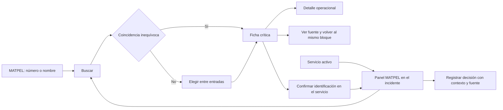

# Fase 2 — experiencia MATPEL

Fecha: 2026-10-08. Diseño de pantallas y recorridos para implementación. Los esquemas siguientes describen organización visual, sin insertar incidentes, materiales o recursos ficticios. [Arquitectura](FASE_2_ARQUITECTURA.md), [contratos](FASE_2_CONTRATOS.md) y [matriz GRE → contexto](FASE_2_MATRIZ_GRE.md).

## 1. Navegación y dos recorridos

MATPEL tendrá entrada propia dentro del grupo Operaciones del dashboard, con permisos de consulta. Servicios tendrá acceso contextual desde el incidente/servicio activo. El acceso de campo usa la misma ficha visual y conserva servicio, material seleccionado y posición de lectura.

La consulta independiente no exige crear un incidente, elegir cantidad ni informar viento. El panel del incidente aprovecha datos ya disponibles, con origen/calidad visibles, y pide solo las condiciones que faltan para la información solicitada. La ficha inicial muestra guía y peligros incluso si no se pueden determinar distancias.



La coincidencia única abre ficha; no confirma identificación del incidente. «Usar en este servicio» muestra entrada, guía y certeza elegida antes de guardar. Una selección ambigua u OCR se confirma una vez en ese paso; la lectura de información no genera confirmaciones. Un ingreso manual puede guardarse NO_CONFIRMADO o CONFIRMADO según lo que declare el operador, con evidencia cuando esté disponible.

## 2. Pantallas y jerarquía

| Pantalla / componente propuesto | Nivel 1: visible | Nivel 2: desplegable | Nivel 3: fuente |
|---|---|---|---|
| Inicio MATPEL `/dashboard/matpel` | Campo «Número ONU / identificación o nombre», Buscar, acceso breve a consulta por guía y material desconocido, edición disponible | Filtros de búsqueda por criterios respaldados; ayuda de identificación | Cómo usar GRE y documento íntegro |
| Resultados | Identificador, nombre original, guía, P/advertencia si existe y condición de coincidencia | Otros nombres respaldados y fuente del índice; clasificación solo si existe | Entrada en amarillo/azul |
| Ficha `/dashboard/matpel/materiales/:entradaId` | Identificación, edición, guía; peligros en orden original, seguridad y advertencias críticas | Respuesta por incendio/derrame/primeros auxilios, distancias condicionadas, notas/anexos pertinentes | «Ver fuente» junto a cada bloque, guía íntegra y PDF |
| Panel MATPEL del incidente | Contexto del Servicio persistente, certeza/material, peligro primario, seguridad y distancias aplicables o motivo; acceso a Registrar decisión | Condiciones, viento/fecha/calidad, respuesta pertinente, recursos autorizados y detalle de selección | Fuentes por dato, evaluación histórica y cronología existente |
| Registro de decisión | Responsable acreditado, texto y fundamento, material/edición/condiciones consultadas, fecha del hecho | Fuentes consultadas y última evaluación; advertencia de cambios/conflicto | Vínculo al snapshot al revisar historial |
| Fuente | Título, edición, página PDF y etiqueta impresa; fragmento/página real | PDF íntegro o descarga autorizada; saltos a otras referencias del mismo bloque | Documento conservado, sin reinterpretar texto |
| Administración GRE | Versión activa, candidatos, progreso y hallazgos; acciones según permiso | Comparación, revisión celda ↔ fuente, cobertura, activación/recuperación | Hashes, parser y trazas técnicas únicamente aquí |

Peligros y seguridad se leen como bloques completos pertinentes: reducir longitud mediante despliegue, sin recortar frases que contienen una condición/negación. Si la parte crítica es extensa, mostrar aviso destacado completo y acceso inmediato al resto; no construir un resumen médico/operativo nuevo. Dentro de cada guía conservar prioridad y orden de la fuente.

### 2.1. Esquema de ficha en escritorio

```text
MATPEL                         Edición disponible           Volver
[Número o nombre                                             ] Buscar

IDENTIFICACIÓN  |  nombre original  |  guía  |  estado de certeza
ADVERTENCIAS pertinentes, incluida P cuando exista

PELIGROS (orden GRE)                SEGURIDAD PÚBLICA
Contenido con condiciones          Contenido con condiciones
Ver fuente                         Ver fuente

AISLAMIENTO / PROTECCIÓN            CONDICIONES NECESARIAS
Valor y finalidad, o motivo         Solo datos pertinentes
Estado de aplicabilidad             Desconocido permitido
Ver fuente / explicación            Origen y fecha

Respuesta de emergencia | Guía completa | Anexos pertinentes
```

### 2.2. Esquema del panel en móvil

```text
SERVICIO ACTUAL · fase actual             Volver al incidente
MATPEL · identificación y certeza

Advertencias críticas
Peligro primario y seguridad
Ver fuente junto al bloque

Distancias / motivo de no determinación
Condiciones [expandir]
Respuesta pertinente [expandir]
Mapa [abrir cuando sea útil]

Registrar decisión (si está autorizado)
Guía completa · Fuente · Historial
```

En móvil, una columna y orden idéntico de prioridad. Encabezado del Servicio compacto y persistente; teclado o barra inferior no ocultan advertencias/acciones. Mapa bajo información textual, sin descargar tiles al entrar si no se abre. No modificar login ni activar tema oscuro global. El modo noche del incidente, si lo implementa su trabajo propio, debe usar sus tokens y respetar contrastes sin afectar consulta/documentos.

## 3. Estados explícitos y textos de interfaz

| Estado | Texto / presentación | Acción útil |
|---|---|---|
| Inicio sin búsqueda | «Buscá por número o nombre»; control vacío, sin resultados ficticios | Escribir/pegar; acceso a guía/identificación desconocida |
| Cargando | «Buscando…» o esqueleto del bloque; conservar término | Evitar envíos duplicados; cancelar respuesta vieja si cambia consulta |
| Sin coincidencias | «No encontramos coincidencias para esta búsqueda» | Corregir entrada, consultar identificación por placa o guía; mantener texto |
| Catálogo no activado | «La consulta estructurada todavía no está disponible» | Fuente original autorizada si fue incorporada; administración según permiso |
| Error de consulta | «No pudimos cargar esta información» | Reintentar; fuente autorizada. No mostrar cero resultados |
| Varias entradas | «Este número tiene varias entradas. Elegí la que corresponde» | Nombres originales completos y condiciones; nunca seleccionar la primera automáticamente |
| Material desconocido | «Material desconocido» | Consulta de orientación/guía 111 y métodos de identificación; no inventar distancias |
| Identificación pendiente | «Material no confirmado» / «OCR: requiere confirmación» | Confirmar o corregir; guía del candidato marcada como consulta |
| Cantidad/viento sin determinar | Dato «Desconocido» junto a resultado dependiente | Completar solo ese dato; peligros/guía siguen accesibles |
| Tabla no aplicable | «Esta tabla no aplica a las condiciones registradas» y motivo | Información pertinente de guía; fuente |
| Datos insuficientes | «No determinado» con listado breve de faltantes | Editar condiciones pertinentes; no cifra predeterminada |
| Extracción/registro no validado | «Datos no disponibles — ver fuente» | Página original y reporte administrativo según permiso |
| Más de un material | «Hay varios materiales. Este flujo no determina la respuesta de la mezcla» | Fichas individuales para consulta y decisión humana; sin perímetro agregado automático |
| Respuesta desactualizada | «Los datos del incidente cambiaron» | Refrescar evaluación; mostrar fecha/revisión del resultado anterior |
| Sin tiles / meteorología | «Mapa base no disponible» / «Viento no disponible» | Continuar lectura; ingresar observación de viento sin convertirla en medición confirmada |
| Sin conexión con descarga previa | «Consulta local · edición descargada» | Buscar en catálogo/PDF local validado; informar antigüedad |
| Sin conexión y sin descarga | «Esta edición no está descargada en el dispositivo» | Recuperar conexión; no afirmar consulta offline disponible |
| Cambio local pendiente | «Guardado en este dispositivo · pendiente de sincronización» | Ver cola y conservar borrador; no mostrar confirmado en servidor |
| Conflicto | «Otra sesión modificó estos datos» y diferencias autorizadas | Revisar borrador contra versión actual antes de reenviar |
| Sin autorización | Acción ausente o deshabilitada con razón cuando ayuda a entender | Seguir consulta permitida; no pedir privilegios administrativos para leer GRE |

Estados de fuente nunca se expresan solo mediante color. Diferenciar procedencia («GRE», «Operador», «Meteorología», «Calculado por SIGBO», «Decisión del SCI») de certeza («Desconocido», «No confirmado», «Estimado», «Confirmado»). En campo mostrar etiquetas familiares y fecha; hash, parser y motor quedan en detalle/auditoría.

## 4. Fuente, decisiones y recursos

«Ver fuente» abre panel lateral en escritorio y vista de lectura en móvil, con cierre y retorno al control/bloque de origen. Conserva búsqueda, selección y scroll. Si el visor nativo no posiciona el PDF, indicar página PDF y etiqueta impresa y permitir lectura/descarga autorizada; no afirmar que resaltó un fragmento si no se puede comprobar.

El registro de decisión toma responsable de sesión y autoridad del núcleo, muestra exactamente qué contexto/edición se conservará y solicita texto/fundamento. «Registrar decisión» es la acción final explícita. Solo ante discrepancia, anulación o cambio crítico usar confirmación adicional concreta con resumen de efecto; no encadenar «¿estás seguro?» genéricos. Si cambia contexto antes de guardar, mostrar diferencias, conservar texto y exigir revisión.

Recursos del incidente muestran presencia/disponibilidad, especialidad/fecha si está autorizada y verificación de compatibilidad pendiente. No se rotula «apto MATPEL» por aparecer en inventario. La asignación y solicitud se hacen con capacidades del núcleo existentes; el panel ofrece información GRE relacionada, sin emitir una orden de asignación.

## 5. Componentes y accesibilidad

| Componente propuesto | Responsabilidad |
|---|---|
| `BuscadorMatpel` | Búsqueda, validación mínima, Enter y cancelación de respuestas antiguas |
| `ResultadosMatpel` | Coincidencia, candidatos y acceso claro a la entrada real |
| `FichaMatpel` | Jerarquía compartida consulta/incidente; bloques completos y etiquetas |
| `EstadoDato` | Procedencia/certeza separadas con texto legible, sin depender del color |
| `DistanciasMatpel` | Finalidad, condiciones, unidad y estado; no cifra cuando no determinada |
| `CondicionesMatpel` | Edición progresiva de parámetros pertinentes; valor desconocido explícito |
| `FuenteGre` | Renderizador reutilizado, numeración, fragmento, foco y retorno |
| `PanelMatpelIncidente` | Conservar contexto del Servicio; capacidades y revisión |
| `DecisionMatpel` | Formulario breve y snapshot; errores/conflictos sin perder texto |

Conservar `.card`, `.input-field`, `.btn-primary`, `.badge`, `Aviso`, `Cargando` y `ConfirmProvider`; sin nueva librería UI. Tokens institucionales; controles principales al menos 44×44 px como criterio del proyecto. Etiquetas asociadas a controles, foco visible y navegación completa con teclado. Anunciar búsqueda/guardado/error mediante roles apropiados; no repetir todo el contenido crítico en cada refresco.

Acordeones operables con teclado, nombre y estado expandido; tabla con encabezados, unidades y notas vinculadas. Diálogo/visor devuelve foco y no lo pierde en iframe; cierre visible y Escape. Zoom 200%, ancho 360 px sin scroll horizontal de la ficha, lector de pantalla y contraste se comprueban en implementación. Tablas amplias pueden desplazarse dentro de su contenedor rotulado, con alternativa de lectura de fila completa.

## 6. Criterios medibles y validación con usuarios

Objetivos de diseño, **todavía no mediciones**. Se documentan tiempos, errores y dificultades con operadores reales sin insertar datos ficticios en la aplicación.

| Id | Tarea / objetivo | Comprobación prevista |
|---|---|---|
| UX01 | Búsqueda inequívoca desde MATPEL: ingresar término y buscar; ficha sin configuración previa | Máximo una acción de búsqueda tras escribir; foco en ficha/resultado y tecla Enter |
| UX02 | Identificador ambiguo: una selección explícita después de resultados | Ninguna entrada asociada automáticamente al Servicio |
| UX03 | Dentro del incidente, identificación, certeza, peligros y seguridad accesibles sin salir de él | Recorrido de usuario y revisión a 360 px; no esconderlo detrás de filtros/mapa |
| UX04 | Abrir fuente del bloque y volver conserva búsqueda/scroll/contexto | Una acción para abrir y una para volver, teclado y lector de pantalla |
| UX05 | Usuario reconoce dato GRE, dato estimado y decisión humana | Prueba con al menos cinco operadores representativos; registrar confusiones y corregir antes de cierre |
| UX06 | Cantidad/agua/viento desconocidos no obligan a inventar valor | Casos de falta de dato y resultados con motivo visible |
| UX07 | Registrar decisión o conflicto no pierde texto ni fuente utilizada | Dos sesiones y desconexión, idempotencia/versión y revisión visual |
| UX08 | Consulta inicial rápida sobre catálogo real | Objetivo de API p95 ≤500 ms y ficha visible ≤2 s en entorno/LAN definidos; medir tamaño de payload, cache, dispositivo y red en fase 4/5; ajustar con evidencia |
| UX09 | Controles, teclado, contraste, zoom y foco utilizables | Recorrido escritorio/móvil, 44×44, zoom 200% y chequeos de accesibilidad del proyecto |
| UX10 | Degradación deja guía/fuente utilizable cuando falla una dependencia secundaria | Casos con tiles, OCR, viento y red fallidos por separado; capacidad real por plataforma |

Los cinco operadores y presupuestos de tiempo son objetivos de aceptación propuestos, no autoridades asignadas ni resultados obtenidos. Cambios de criterio se registran con motivo y evidencia; no se sustituye una prueba humana por el conteo de pruebas de URL del frontend.
