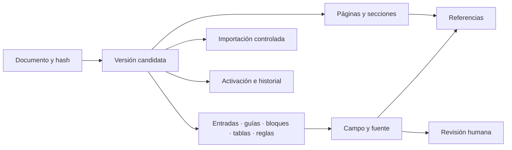

# Fase 3A — fuente documental y modelo GRE

Trabajo: 2026-10-08–09. Entrega de base técnica; la extracción de materiales/guías/tablas y las pantallas continúan en sus etapas correspondientes. El catálogo todavía no está importado, validado ni activado en SQL Server.

## Resultado implementado

[importar_gre.py](../../scripts/matpel/importar_gre.py) identifica fuentes por cabecera PDF y texto nativo de portada, sin depender de nombre o extensión. La edición se obtiene de la portada; una edición ambigua se rechaza para revisión. Actualmente admite GRE en español. Enumera archivos descartados con motivo y requiere selección explícita cuando hay varias fuentes, aunque compartan hash. No sigue enlaces de archivos al exterior de la carpeta.

La etapa documental lee una instantánea acotada a 64 MiB/3.000 páginas, conserva el PDF íntegro en `backend/private_uploads/gre` y lo identifica por SHA-256. El límite es de protección del proceso, no una regla operacional. La carpeta no forma parte del área estática `/uploads`; los archivos de ejecución están excluidos de Git. El comando no accede a DB, red, OCR ni APIs de IA.

La publicación usa un archivo temporal terminado y un enlace exclusivo dentro del mismo directorio. Un reintento acepta únicamente bytes idénticos; una copia alterada produce error y se conserva para investigación, sin sobrescritura. El almacenamiento debe soportar enlaces duros; ante falta de soporte se informa error, sin degradar a publicación parcial. La copia PDF y su manifiesto se publican por separado; si se interrumpe entre ambos, el reintento recupera el manifiesto sin duplicar el PDF. Un archivo temporal abandonado no es fuente publicada.

El cierre recuperado de la sesión verifica además interrupción entre PDF y manifiesto, manifiesto corrupto, fallo al publicar el enlace, dos publicaciones simultáneas y descubrimiento con un PDF truncado. Son pruebas documentales con la fuente real y archivos temporales; no crean datos operativos ni activan una edición. Comandos, resultados y límites en [FASE_3A_VALIDACION.md](FASE_3A_VALIDACION.md).

Fuente real preparada: GRE 2024, español, 8.182.725 bytes y 392 páginas. SHA-256 `bfc8b663259528dadd81a499afac2d5fd417467786ac616fb31625680f4ea4af`. [Evidencia documental](evidencia/fase3a/documento.json).

## Numeración y contrato documental

El manifiesto JSON UTF-8 tiene `tipo = gre_documento_candidato`, `schemaVersion = 1`, `versionDocumental = documento-1` y `estadoCatalogo = NO_IMPORTADA`. Incluye identidad/portada, referencia privada, herramienta/versiones, páginas y marcadores reales. No contiene materiales o distancias deducidas. Su nombre incorpora hash, versión documental y versión de PyMuPDF; actualizar una herramienta no sobrescribe el manifiesto de la anterior.

Cada página guarda:

- `paginaPdf` desde 1, etiqueta interna PDF y todas las etiquetas impresas encontradas, con texto/caja de procedencia.
- Dimensiones sin rotar, rotación original, cantidad de caracteres y hash del texto nativo.
- Indicación de numeración impresa ambigua; no selecciona una etiqueta por intuición.

Las etiquetas internas empiezan en `i`, `ii`, `1`. La página PDF 154 conserva varios números impresos y queda marcada para revisión. Los 40 marcadores del PDF se conservan como marcadores, sin convertirlos en las 42 secciones del inventario: portada/contraportada y cobertura se conciliarán con la clasificación real en 3B.

Las cajas usan `PYMUPDF_SIN_ROTAR_PT`, puntos en la página sin rotar. La rotación se conserva separadamente para que el visor aplique la transformación. No se presupone desplazamiento global entre página PDF y página impresa. El manifiesto es una evidencia documental, no una entrada confiable a SQL: en 3B–D el servicio de importación deberá validar el artefacto, límites y cobertura antes de persistir.

## Modelo preparado

Se incorporaron 18 entidades TypeORM y sus 18 tablas en la migración aditiva [094_gre_base_documental.sql](../../database/migrations/094_gre_base_documental.sql). Se usa un archivo por entidad, conforme al índice del proyecto; las claves foráneas son columnas planas y los joins serán explícitos. Las entidades están exportadas en [index.ts](../../backend/src/shared/entities/index.ts); `synchronize` permanece deshabilitado.

| Grupo | Entidades | Función |
|---|---|---|
| Identidad | GreDocumento, GreVersion | Archivo inmutable; versiones de parser/normalizador/esquema, revisión de correcciones y vínculo a candidata anterior |
| Procedencia | GrePagina, GreSeccion, GreReferencia, GreCampoFuente | Numeración, rangos, texto/caja/método/confianza y referencias de cada campo |
| Catálogo | GreGuia, GreEntrada, GreAlias, GreBloque | Guías vacías explícitas, varias entradas por identificador, alias respaldados y texto jerárquico completo |
| Condiciones | GreTabla, GreFila, GreCelda, GreRegla | Estructura, valores originales, unidades, condiciones y reglas revisadas |
| Revisión/proceso | GreRevision, GreImportacion | Hallazgos/correcciones auditables, trabajo duradero, lease y heartbeat |
| Publicación | GreActivacion, GreActivacionHistorial | Puntero por idioma e historial con revisión, actor, fundamento e idempotencia |



Las relaciones de catálogo y campo ↔ fuente usan FKs compuestas con `version_id`. GreCampoFuente exige exactamente un registro destinatario mediante CHECK y nueve FKs posibles; evita ids polimórficos sin integridad y admite varias referencias para un mismo campo. GreRevision referencia ese vínculo y conserva actor, fundamento y valores envueltos como objetos/arrays JSON, compatibles con `ISJSON` de SQL Server.

Documento incorpora actor y evidencia de identificación. Una entrada conserva id propio: el número ONU no es clave única. Las banderas verde/P admiten null cuando todavía no se han comprobado. Una celda distingue DATO, REFERENCIA, VACIO_EXPLICITO y NO_VALIDADO; vacío no equivale a cero. Los decimales se conservan como texto canónico, además del original, sin imponer una escala SQL aún no conciliada con todas las tablas. El parser rechazará valores que excedan los límites de columna; no truncará ni redondeará silenciosamente. Validación léxica/unidades y reglas ejecutables continúan en 3C/4.

La identidad de candidata es documento + parser + normalizador + esquema + `revision_correcciones`. La extracción inicial usa revisión 0. Una corrección posterior crea otra candidata con `derivada_de_id`, sin inventar una nueva versión del parser ni alterar una versión validada. Este detalle concreta el diseño de fase 2 para conservar historial e idempotencia.

El DDL prepara índices por versión/identificador/nombre/guía y controles de JSON, estados, rangos, confianza y pertenencia. No usa cascadas de borrado. Disparadores propuestos protegen documento, versiones validadas y contenido asociado; revisiones/activaciones históricas son inmutables. Un puntero solo acepta una versión VALIDADA del mismo idioma. El servicio de activación de 3D deberá además verificar reporte completo, revisión, autoridad, transacción, bloqueos, comparación e historial: marcar un estado SQL no sustituye esos controles.

Los 18 archivos de entidad documentan explícitamente que el esquema está preparado. Declarar una entidad o indexarla en el grafo no acredita existencia de su tabla en una DB real.

## Servicios internos y alcance

[GreModule](../../backend/src/modules/gre/gre.module.ts) registra repositorios y exporta [GreCatalogoService](../../backend/src/modules/gre/gre-catalogo.service.ts) y [GreFuentesService](../../backend/src/modules/gre/gre-fuentes.service.ts). Está preparado, sin controladores ni registro en AppModule. No inicia workers/importaciones al arrancar. Los 30 endpoints del diseño continúan siendo futuros; esta entrega no concede permisos.

GreCatalogoService resuelve documentos/referencias únicamente de una versión explícita VALIDADA, comprueba pertenencia y rango de página y no altera el puntero activo. GreFuentesService admite solo referencias `privado:gre:<sha256>.pdf`, comprueba ruta real, tamaño, cabecera e integridad SHA-256 y valida cajas/versiones/páginas. No expone rutas arbitrarias ni convierte una referencia incompleta en coordenadas inventadas.

Estos servicios son internos. El controlador futuro debe aplicar sesión, capacidades y alcance antes de usarlos, y construir un DTO que no exponga rutas físicas. Lectura administrativa de candidatos será un contrato separado. No existe aún una descarga GRE HTTP autorizada.

## Uso local verificable

Dependencia exacta declarada en [requirements.txt](../../scripts/matpel/requirements.txt): PyMuPDF 1.28.2, comprobada en este entorno. Ejecutar desde la raíz:

```powershell
python scripts/matpel/importar_gre.py --listar
python scripts/matpel/importar_gre.py
```

Con varias fuentes, pasar a `--documento` el nombre exacto de un candidato listado. `--carpeta` cambia la carpeta de descubrimiento. `--almacenamiento` es una opción de administración local; debe apuntar a un almacén privado, nunca a una carpeta pública. No se traslada a HTTP ni recibe comandos del usuario final.

La migración 094 fue agregada al orden y al manifiesto de hashes del ejecutor. Su modo `-ValidateOnly` comprueba archivos/orden/hashes y termina antes de conexiones SQL; **no prueba ejecución de T-SQL**. No se aplicó la migración ni se reinició/desplegó la aplicación. La aplicación de DDL y pruebas de restricciones/triggers/concurrencia necesitan DB de prueba identificada y autorización aplicable según AGENTS.md.

## Continuación

**3B: extracción de índices amarillo/azul y guías completas**, conciliación de nombres/identificadores, encabezados, señales P/verde y referencias reales. Mantener vacías las guías 121/167 y excluir el ejemplo de PDF 154 como guía nueva. Después, 3C cubrirá todas las tablas/condiciones y 3D la revisión, jobs y activación. La fase 3 completa sigue abierta.
